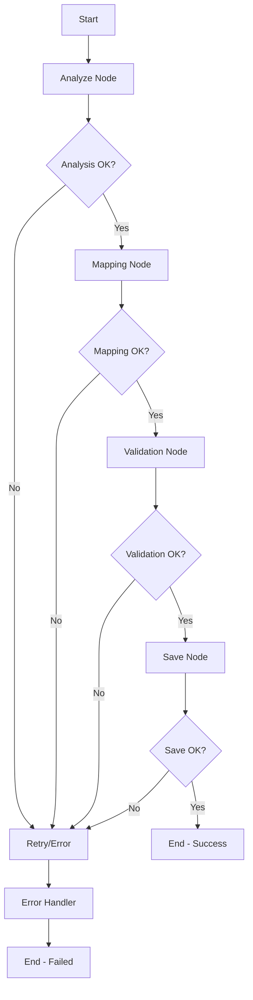

# LangGraph Migration Workflow

## 🎯 Tổng quan

Hệ thống migration sử dụng **LangGraph** để tạo ra một workflow có cấu trúc, dễ quản lý và có thể theo dõi chất lượng cho quá trình chuyển đổi dữ liệu IELTS từ cấu trúc cũ sang cấu trúc mới.

## 🏗️ Kiến trúc

### State Management
- **MigrationState**: TypedDict chứa toàn bộ state của workflow
- **MigrationStatus**: Enum theo dõi trạng thái hiện tại
- **QualityMetrics**: Metrics đánh giá chất lượng migration

### Workflow Nodes
1. **AnalyzeNode**: Phân tích cấu trúc dữ liệu đầu vào
2. **MappingNode**: Áp dụng rules chuyển đổi dữ liệu  
3. **ValidationNode**: Kiểm tra chất lượng dữ liệu
4. **SaveNode**: Lưu kết quả vào database
5. **ErrorHandlerNode**: Xử lý lỗi và retry logic

### Flow Control
- **Conditional Edges**: Quyết định bước tiếp theo dựa trên kết quả
- **Retry Logic**: Tự động retry khi gặp lỗi (max 3 lần)
- **Quality Gates**: Kiểm tra chất lượng tại mỗi bước

## 📁 Cấu trúc File

```
app/
├── schemas/
│   └── migration_state.py          # State schema cho LangGraph
├── services/
│   ├── migration_nodes.py          # Các Node xử lý
│   ├── migration_workflow.py       # LangGraph workflow
│   └── migrate_service.py          # Service chính (đã cập nhật)
└── repositories/
    └── migrate_repository.py       # Database operations

test_migration_workflow.py          # Test script
```

## 🚀 Cách sử dụng

### 1. Cài đặt Dependencies

```bash
pip install -r requirements.txt
```

### 2. Chạy Migration

```python
from app.services.migrate_service import MigrateService
from app.repositories.migrate_repository import MigrateRepository

# Tạo service
migrate_repo = MigrateRepository()
migrate_service = MigrateService(migrate_repo)

# Chạy migration
result = migrate_service.create_migrate_process(
    input_data=your_quiz_data,
    user_id="user123"
)

# Theo dõi tiến độ
status = migrate_service.get_migrate_status(result["migrate_process_id"])
```

### 3. Test Workflow

```bash
python test_migration_workflow.py
```

## 📊 Monitoring & Quality Control

### Quality Metrics
- **Total Questions**: Tổng số câu hỏi
- **Successfully Mapped**: Số câu hỏi mapping thành công
- **Failed Mappings**: Số câu hỏi mapping thất bại
- **Quality Score**: Điểm chất lượng (0-100)
- **Processing Time**: Thời gian xử lý

### Processing Logs
Mỗi step được log chi tiết với:
- Timestamp
- Level (info/warning/error)
- Message
- Details (nếu có)

### Error Handling
- **Automatic Retry**: Tự động retry tối đa 3 lần
- **Graceful Degradation**: Tiếp tục xử lý khi có lỗi nhỏ
- **Detailed Error Tracking**: Log chi tiết mọi lỗi

## 🔧 Configuration

### Workflow Config
```python
config = {
    "enable_parallel_processing": True,
    "quality_threshold": 80.0,        # Ngưỡng chất lượng tối thiểu
    "max_validation_errors": 5,       # Số lỗi validation tối đa
    "max_retries": 3                  # Số lần retry tối đa
}
```

### Quality Thresholds
- **Quality Score < 80%**: Warning
- **Failed Mappings > 50%**: Error
- **Validation Errors > 5**: Error

## 🎛️ Workflow Flow



## 🔍 Debugging

### Logs Location
- **Application Logs**: Theo Flask logging config
- **Processing Logs**: Trong MigrationState
- **Database Logs**: Trong migrate_process table

### Common Issues
1. **Import Errors**: Kiểm tra dependencies
2. **Database Connection**: Kiểm tra connection string
3. **Memory Issues**: Giảm batch size nếu cần

## 🚀 Tính năng nâng cao

### Parallel Processing
- Xử lý nhiều parts đồng thời (nếu enable)
- Tối ưu performance cho quiz lớn

### Memory Management
- LangGraph MemorySaver để lưu state
- Có thể resume workflow nếu bị gián đoạn

### Extensibility
- Dễ dàng thêm node mới
- Flexible conditional logic
- Pluggable quality checks

## 📈 Performance

### Benchmarks
- **Small Quiz** (1-2 parts): ~2-5 giây
- **Medium Quiz** (3-5 parts): ~5-15 giây  
- **Large Quiz** (6+ parts): ~15-30 giây

### Optimization Tips
- Enable parallel processing
- Tối ưu database queries
- Cache structure rules nếu cần

## 🔮 Roadmap

### Phase 1 (Hiện tại)
- ✅ Basic workflow với 4 nodes
- ✅ Error handling và retry
- ✅ Quality metrics
- ✅ Database integration

### Phase 2 (Tương lai)
- 🔄 Advanced mapping rules engine
- 🔄 Real-time progress updates
- 🔄 Batch processing multiple quizzes
- 🔄 AI-powered quality suggestions

### Phase 3 (Xa hơn)
- 🔄 Machine learning cho auto-mapping
- 🔄 Advanced analytics dashboard
- 🔄 Integration với external systems
- 🔄 Multi-tenant support

## 🤝 Contributing

1. Thêm node mới trong `migration_nodes.py`
2. Cập nhật workflow trong `migration_workflow.py`
3. Thêm test cases
4. Cập nhật documentation

## 📞 Support

Nếu có vấn đề, hãy kiểm tra:
1. Logs trong database
2. Processing logs trong state
3. Test script results
4. Dependencies version 