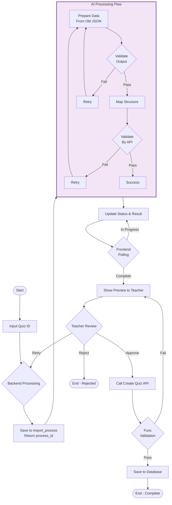

```mermaid
flowchart TD
    %% Main Flow
    Start([Start]) --> InputQuiz[Input Quiz ID]
    InputQuiz --> BE{Backend Processing}
    
    %% Backend Initial Processing
    BE --> SaveImport[Save to import_process<br/>Return process_id]
    SaveImport --> AIFlow
    
    %% AI Processing Flow
    subgraph AIFlow[AI Processing Flow]
        direction TB
        PrepareData[Prepare Data<br/>From Old JSON] --> ValidatePrep{Validate<br/>Output}
        ValidatePrep -->|Pass| MapStructure[Map Structure]
        ValidatePrep -->|Fail| RetryPrep[Retry]
        RetryPrep --> PrepareData
        
        MapStructure --> ValidateMap{Validate<br/>By API}
        ValidateMap -->|Fail| RetryMap[Retry]
        RetryMap --> PrepareData
        
        ValidateMap --> |Pass| Success[Success]
    end
    
    %% Frontend Processing
    AIFlow --> UpdateStatus[Update Status & Result]
    UpdateStatus --> FEPoll{Frontend<br/>Polling}
    FEPoll -->|In Progress| UpdateStatus
    FEPoll -->|Complete| Preview[Show Preview to Teacher]
    
    %% Teacher Review
    Preview --> TeacherReview{Teacher Review}
    TeacherReview -->|Approve| CreateQuiz[Call Create Quiz API]
    TeacherReview -->|Reject| Reject([End - Rejected])
    TeacherReview -->|Retry| BE
    
    %% Quiz Creation
    CreateQuiz --> FinalValidate{Func<br/>Validation}
    FinalValidate -->|Pass| SaveDB[Save to Database]
    FinalValidate -->|Fail| Preview
    
    SaveDB --> Complete([End - Complete])
    
    %% Styling
    style AIFlow fill:#f3e5f5,stroke:#4a148c,stroke-width:2px
    
    class Start,Complete,Reject start
    class InputQuiz,SaveImport,PrepareData,MapStructure,UpdateStatus,Preview,CreateQuiz,SaveDB process
    class BE,ValidatePrep,ValidateMap,FEPoll,TeacherReview,FinalValidate decision
```