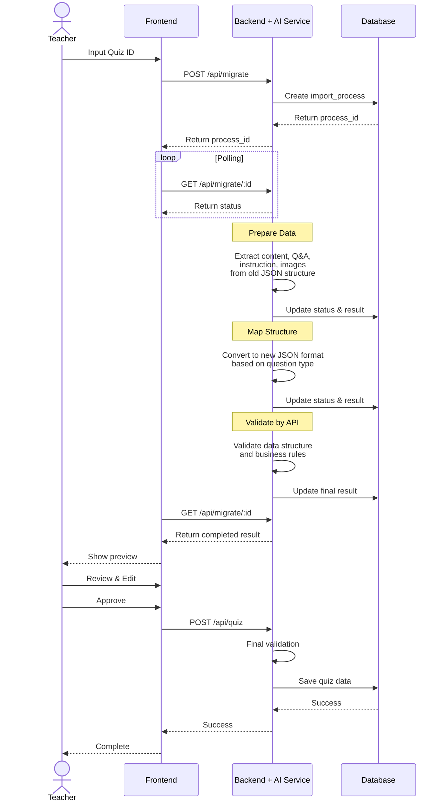

```mermaid
sequenceDiagram
    actor Teacher
    participant FE as Frontend
    participant BE as Backend + AI Service
    participant DB as Database
    
    Teacher->>FE: Input Quiz ID
    FE->>BE: POST /api/migrate
    BE->>DB: Create import_process
    DB-->>BE: Return process_id
    BE-->>FE: Return process_id
    
    loop Polling
        FE->>BE: GET /api/migrate/:id
        BE-->>FE: Return status
    end
    
    Note over BE: Prepare Data
    BE->>BE: Extract content, Q&A,<br/>instruction, images<br/>from old JSON structure
    BE->>DB: Update status & result
    
    Note over BE: Map Structure
    BE->>BE: Convert to new JSON format<br/>based on question type
    BE->>DB: Update status & result
    
    Note over BE: Validate by API
    BE->>BE: Validate data structure<br/>and business rules
    BE->>DB: Update final result
    
    FE->>BE: GET /api/migrate/:id
    BE-->>FE: Return completed result
    FE-->>Teacher: Show preview
    
    Teacher->>FE: Review & Edit
    Teacher->>FE: Approve
    
    FE->>BE: POST /api/quiz
    BE->>BE: Final validation
    BE->>DB: Save quiz data
    DB-->>BE: Success
    BE-->>FE: Success
    FE-->>Teacher: Complete
```